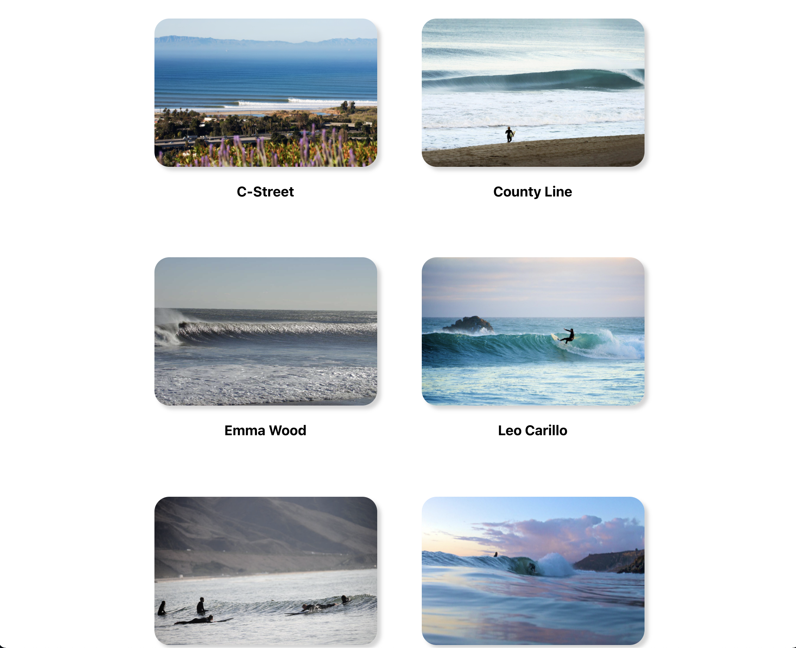

# Shred Live
Website that will allow people to post updates about their favorite outdoor activity locations.

Link to the app --> https://shred-live-updates.herokuapp.com/

## Technologies Used
React.js | Bootstrap | Django

## User Stories
Users can check in at their favorite surf spots. 
Users will be able to post about the surf spot in real time.
User will be able to edit the post according to what they are currently seeing, or opt in to make a new post about the surf spot.
User can post with a photo if desired showing current conditions.

## Walkthrough
Landing Page

Beach List

Beach Details

Beach Posts

## Wireframes

Landing Page Wireframe

Beach Details Wireframe

Application Structure Wireframe

## Unresolved Problems/Issues
- Adding user authentication and allow edit/delete only for that specific user.
- Fix edit posts, currently has a bug with onChange and calling the function.
- Expand website to more beaches, and even more outdoor/locational sport topics.